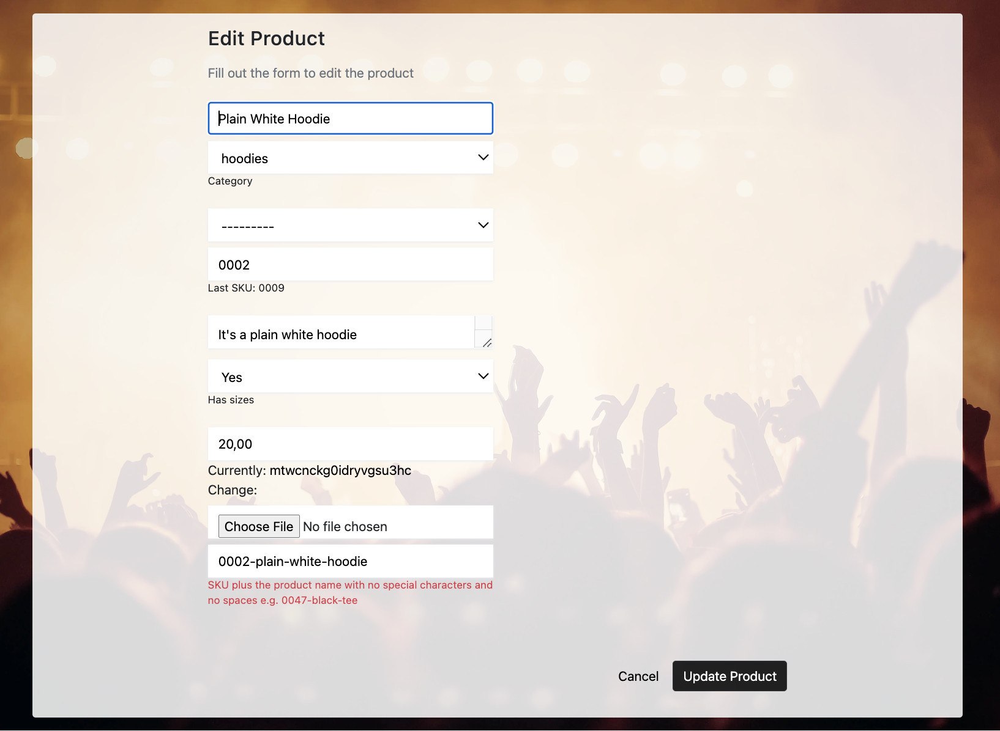
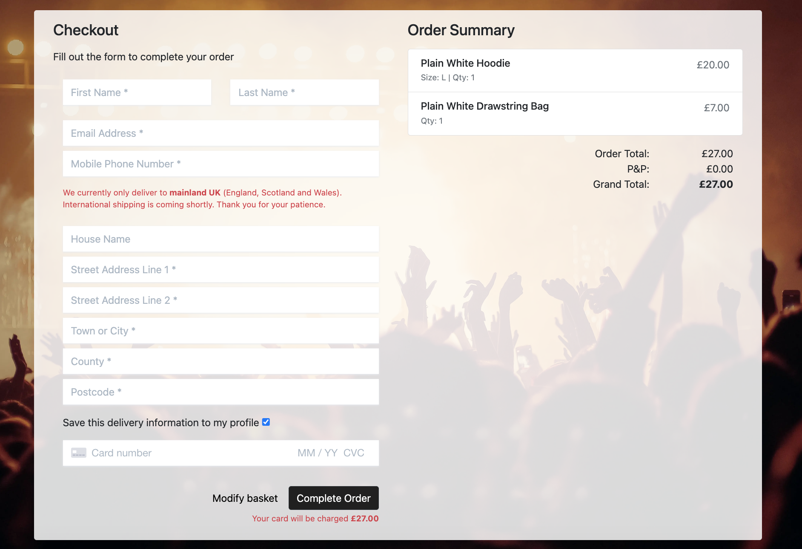
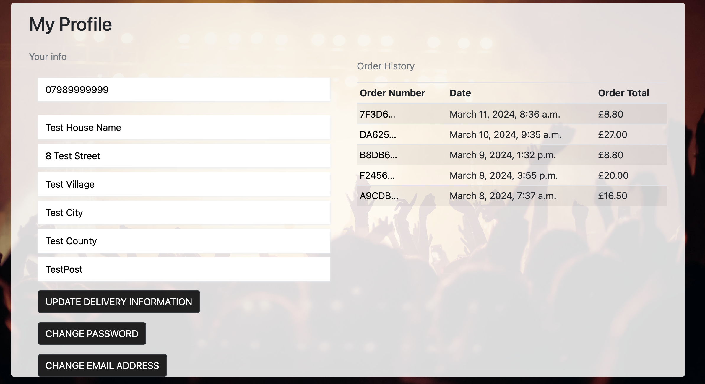

# StageLeft Merchandise

StageLeft Mercahndise is a merchandise management service for bands and artists, taking the responsibility away from them, allowing them to concentrate on their music. The business in its entirety is based around a more complex and involved model, however the online side of the venture is a business to consumer (B2C) e-commerce site aimed at exisiting fans of the musicians that StageLeft work with.

[Live deployment link](https://stage-left-merch-6e2378b5745e.herokuapp.com/)

## Planning and Agile Methodology

At the beginning of the planning process it was decided that an agile approach would be taken during development. This meant that effort would be focued on smaller individual pieces, rather than the puzzle as a whole, allowing for clean delivery of each section until the puzzle is complete. This compartmentalisation of the project allowed for large laborious aspects to be broken down into much smaller, manageable tasks. These tasks were derived from the 10 user stories collected before development:

- Create a draft product
- Shopping basket
- Open a product
- Checkout
- Contact form
- View list of products
- Testimonials
- Mailing list
- User account
- Privacy

Due to the agile method of development, as the process moved forward the goal posts often changed, so the certain aspects of the current iteration of the project may not perfectly reflect the resepctive user story. These aspects will be explained in more details in the features section further on in the documentation.

For further information regarding the initial user stories, please visit the [GitHub Project](https://github.com/users/KitLavis/projects/5/views/1).

### E-Commerce Business Model

As mentioned in the intorductory paragraph, although the company offers more complex and involved services to the bands and artists themselves, the online aspect of StageLeft Merchandise follows a business to consumer (B2C) e-commerce business model. This means that the business (StageLeft) sells products directly to consumers i.e. fans of the artists that the business works with.

### SEO

An important feature of any online business in 2024 is search engine optimisation (SEO), as you can't sell products to people if they don't seem. Therefore a number of items were added to improve StageLeft's "online rating". The simplest and most obvious of these aspects are the keywords in the meta tags within the head element of the base HTML template. As well as these keywords, everything written at the top of a page, within header tags, or within strong tags had thought put in to them so as not to waste the oppurtunity to improve the site's SEO. The final aspect of SEO are the sitemap and robots files. The sitemap.xml file is a list of all the pages of the site that can be accessed without logging in, while the robots.txt file tells search engine crawlers where they can't crawl. Although the robots.txt file tells search engines where not to go, the presence of the file itself gives the page a higher rating as it is acknowledging that search engines can crawl your site in the first place.

### Design

The design elements were kept as minimal as possible while still portraying the aim of the project, and as can be seen in features section, they are kept consistent throughout the majority of the site. The hero image of an audience watching a live act is used as the base on every page, while the elements overlaying this image use utilise simple black and white backgrounds with the opacity lowered slightly to allow for the underlying image to be seen.

Hero Image:

Colour Swatch:

Wireframes:

- All Products:

- Product Detail:

## Features

Due to the nature of the project there are a large number of features, therefore the following section is split into smaller sections, each representing a seperate Django application.

### Base Template and Consistent Features

As well as the overriding design aspects, there are two features that remain consistent across all pages. These are the header and footer. The header consists of a top banner with the company name, and a secondary navigation panel where the user can navigate to the specific product or artist pages, and the testimonials section. The right hand side of the bar holds the user profile links, accessable via a dropdown menu attached to the user icon, as well as the basket icon that links to the basket page. Underneath the basket icon the current order total is shown, so the user does not have to navigate to their basket to keep track of their order. On the opposite side of the navigation bar the user can enter a specific keyword in order to search through all the products and filter what is relevant to them. On smaller devices the navigation bar is collapsed into a burger icon so that the page is not over cluttered.

As is seen below, the dropdown menu accessable via the user icon contains a number of links, which vary in relation to authentication status and user type. If the user is not authenticated, then register and login links are shown. If the user is a customer then logout and account management is shown. If a superuser is authenticated then the two previous options available, as well as the options to view messages and add products.

The footer consists of a number of links that are also present in the navigation bar, as well as a link to the contact page, a mailing list sign up box, and a link to the privacy policy.

### Home

The home app consists of two minor aspects: the hero text and the button that links to all products.

### Products

The products app has three main features: product cards, the product detail page and the add/edit products feature.

- All Products (product cards)

The main feature of the all products page is the product cards that hold the basic information for each product, and a link to see further details. When there are more than 12 products present the page paginates.

- Product detail page

The product detail page does what is says on the tin. When the user clicks the 'more info' button on a product card, they are directed to this page, which holds more detailed information about the product, including: product name, a brief description, the sizes available (if applicable), and the price. From here the user can add the product to their basket.

As is shown in the screenshot below, if a superuser is logged in, edit and delete product buttons are shown, the function of these being self-explanitory. If the user is not a superuser these are not present.

- Add/edit product

These two features are of course two seperate features, however they are described together due to their similarities. These two features are only available to superusers, and other user types attempting to access these features are redirected away. The add and edit product pages consist of the product form, which allows the superuser to add or edit and instance of the product model in the backend, from the frontend.

### Basket

The first variation of the basket page is shown when the user's basket is empty. It shows a small message letting the user know that the basket is empty, and a button to go back to the products page.

The second variation is shown when the user has items in their basket. It consists of the a brief summary of each item, and allows for the quantity of each item to be changed, or removed completely if necessary. In the bottom right hand corner of the page, the user is shown the different totals for the session. If the order total does not reach the amount required for free postage, a message is shown letting the user know how much more they need to spend in order to get their postage for free. Finally, there are the two buttons, one sending the customer back to all products, the other moving the customer forward to the checkout app.

### Checkout

The checkout app is arguably the most complex of the applications - due to the sensitive nature of payment proccessing - however the page itself is kept as simple as possible to allow for a better user experience.

- Checkout page

The checkout page is split into two coloumns; the left half holds the oder form for the customer to complete - the details entered can be saved from here if the user is authenticated - while the right half shows a basic summary of the order. From here the customer has the option to go back on modify their basket, or checkout securely with stripe via the complete order button. A warning is shown underneath the button to remind the user that they will be charged.

The submission of the order form is handled twice: first through the form submit in the javascript that stripe provides, and second by a stripe webhook. This means that if the user accidentaly closes the browser before the form is properly submitted, or if something interupts submission, the order will be created instead from the webhook handler.

- Loading overlay

While the order is being created and the payment is being processed, the customer is shown an overlay to let them know to hold tight while everything is being processed. The user is automatically redirected once everything has finished processing.

- Checkout success

The final aspect of the checkout app is the checkout success page. Once the order and payment are processed the user is shown a brief summary of their order, they are shown a success message, and are reminded that their order details will be available at the email address provided in the order form.

### Artists

The artists app is comparable to the products app. There is an all artists page where a card is shown for each artist the company represents, artist detail pages where the user is given more information about the artist, and links to artist product pages, where the customer view all products related to the artist. There are however also the testimonial features which are explained in further detail beneath the following screenshots.

- Testimonials

The testimonials page is a bootstrap carousel that slides through the reviews left by the artists that the company represents. The buttons shown on this page vary dependant on the user. If the user is a standard user that has no relation with an instance of the artist model, then they will simply be shown the testimonials. If the user has a relation to an artist instance that does not already have a relation to a testimonial, they will be shown an 'add your testimonial' button, to allow the user/artist to leave their testimonial. Finally, if the user has an artist related to their profile and they have already left their testimonial, the other instances of the testimonial model will be shown with no buttons, and their own testimonial will have edit and delete buttons overlaying it, to allow the user to access this functionality from the frontend.

- Add/Edit Testimonial

Much like the add product and edit product features, the add testimonial and edit testimonial features are described together. If the user is related to an instance of the artist model, they are able to add their testionial via this form. If they attempt to add a testimonial for a band/artist other than theirs, they are either warned that the form is invalid or redirected entirely. The same is can be said for the edit testimonial feature.

### User

The user app allows the user to update or delete their delivery information which will be saved so they no longer have to enter these details at checkout. From here the user also has access to a number of Django Allauth features, that allows them to change their email address and password. On the right of the user profile page the user's order history is shown. The user can click one of the order references in order to be redirected back to a version of their checkout success page, to review previous order summaries.

### Contact

- Contact page

The contact page - accessable via a link in the footer - allows the user to create an instance of the message model, allowing them to send a message to the site owner.

- Contact Success

Once the user has submitted a valid contact form they are redirected to the contact success page, which shows them a message letting them know they have successfully sent a message and will be contacted back as soon as possible.

## Development and Deployment

### Tools and Technologies

## Testing and Validation

### Code Validation

### Manual Testing

## Challenges and Bugs

- Cloudinary media files
- Database foregin key
- Checkout duplicate orders

## Credits

### Code Content

### Media and Site Content